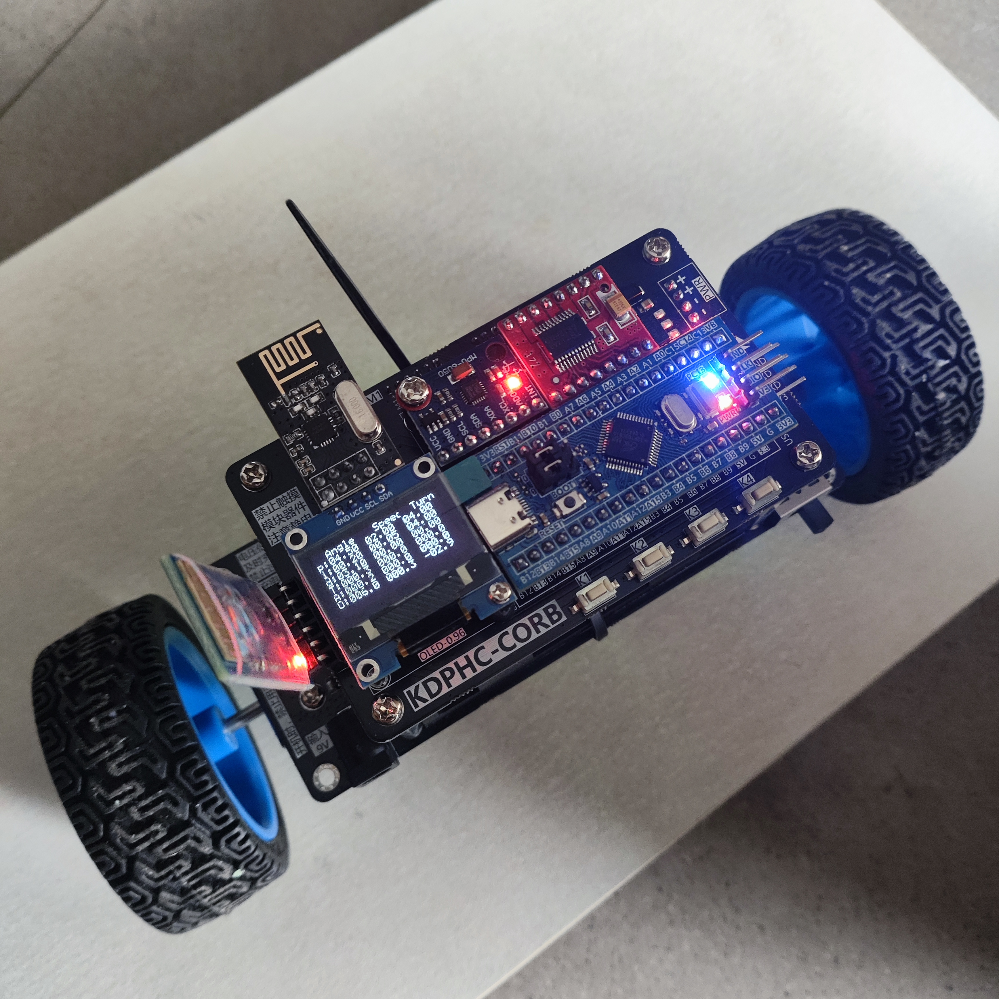
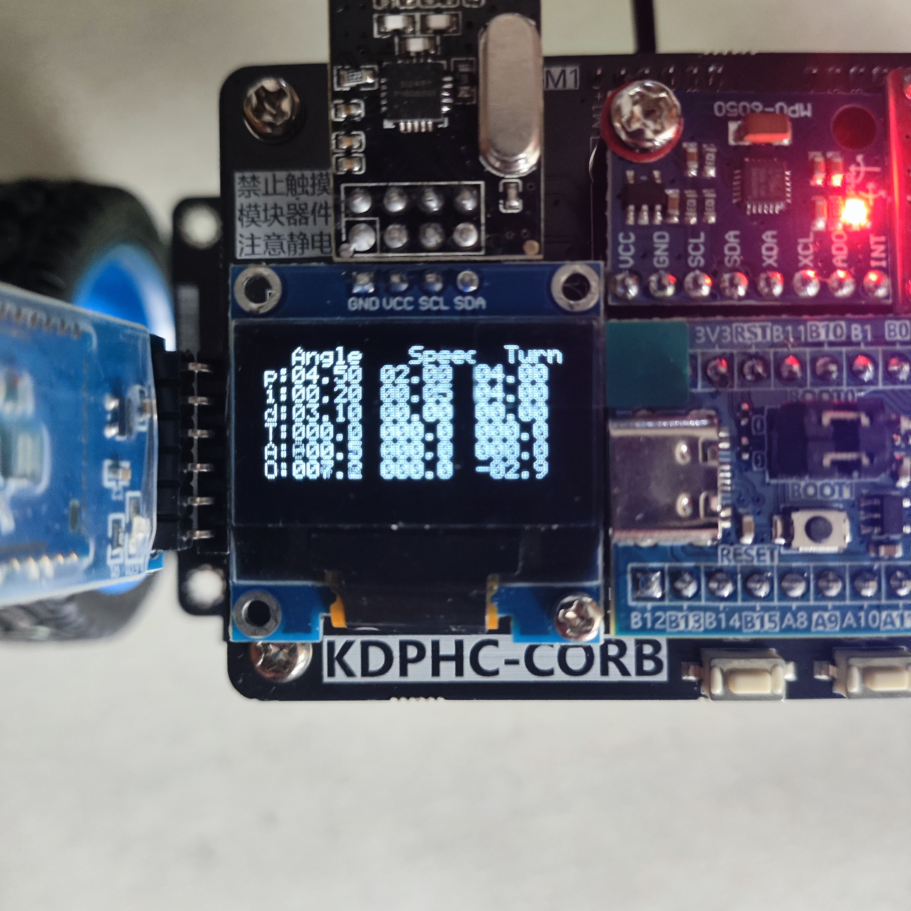
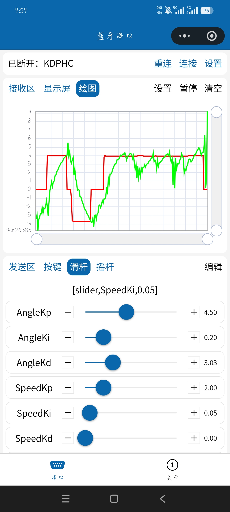
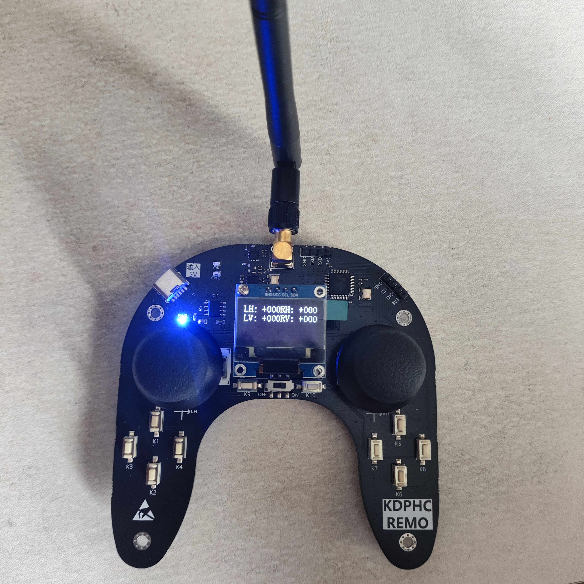

# STM32 Balance Car

基于 **STM32F103C8T6** 的两轮自平衡小车项目。

本项目主要参考 **江协科技 STM32 平衡车系列教学视频**进行学习与实现。原教程主要使用 **Keil** 进行开发，本仓库在其基础上将工程整理为：

**VS Code + CMake + Ninja + GNU Arm Embedded Toolchain + OpenOCD**

并实现平衡控制、速度控制、转向控制、手机蓝牙遥控、PID 在线调参以及 NRF24L01 独立遥控器控制等功能。

> 本项目是一个以学习和复现为目的的个人工程，与江协科技无官方关联。

---

## 项目展示

<p align="center">
  
</p>

<p align="center">
  <sub>小车昵称：泡模板</sub>
</p>

---

## 项目特点

| 项目 | 说明 |
|---|---|
| MCU | STM32F103C8T6 |
| 开发环境 | VS Code |
| 构建系统 | CMake + Ninja |
| 编译器 | GNU Arm Embedded Toolchain |
| 下载 / 调试 | ST-LINK + OpenOCD + GDB |
| 姿态传感器 | MPU6050 |
| 控制算法 | 角度环 + 速度环 + 转向环 |
| 人机交互 | OLED + 按键 + 蓝牙 |
| 遥控方式 | 手机蓝牙 / NRF24L01 独立遥控器 |
| 工程基础 | 参考江协科技平衡车教程 |

---

# 开发环境

江协科技教程主要使用 Keil，本项目改为 VS Code + CMake，因此第一次使用时需要准备 STM32 交叉编译和调试环境。

## 推荐安装

推荐安装：

- Visual Studio Code
- STM32CubeIDE
- C/C++ 扩展
- CMake Tools
- STM32 相关 VS Code 扩展
- ST-LINK 驱动

安装 STM32CubeIDE 的主要目的，是方便直接使用其中自带的：

```text
GNU Arm Toolchain
CMake
Ninja
OpenOCD
GDB
```

也可以自行单独安装这些工具。

### 基本环境检查

```bash
cmake --version
ninja --version
arm-none-eabi-gcc --version
openocd --version
```

本项目要求：

```text
CMake >= 3.22
```

---

## VS Code 配置说明

仓库已经包含：

```text
.vscode/
├── c_cpp_properties.json
├── launch.json
├── settings.json
└── tasks.json
```

并已经配置了：

- Debug 编译
- Clean
- Rebuild
- OpenOCD 烧录
- GDB 调试

> 当前部分配置中仍包含开发机上的 STM32CubeIDE / OpenOCD 绝对路径。  
> Clone 到其他电脑后，需要根据自己的安装位置修改 `.vscode/settings.json`、`.vscode/tasks.json` 和 `.vscode/launch.json` 中的相关路径。

---

# 快速开始

## 1. Clone 工程

```bash
git clone https://github.com/YE-Ab1l1TY/balance-car.git
cd balance-car
```

## 2. 命令行编译

Debug：

```bash
cmake --preset Debug
cmake --build --preset Debug
```

生成文件位于：

```text
build/Debug/
```

主要包括：

```text
phc.elf
phc.hex
phc.bin
```

---

## 3. VS Code 快捷编译 / 烧录

本项目已经配置 VS Code Build Tasks。

在 VS Code 中可以使用：

```text
Ctrl + Shift + B
```

快速调用工程任务。

可用任务包括：

```text
CMake: 编译 (Debug)
CMake: 清理 (Debug)
CMake: 重新编译 (Debug)
STM32: 编译并烧录 (OpenOCD)
```

第一次使用 `Ctrl + Shift + B` 时，VS Code 可能会要求选择具体的 Build Task。

如果已经正确配置本机工具路径，之后即可直接通过 VS Code 完成：

```text
编译
  ↓
生成 phc.elf
  ↓
OpenOCD
  ↓
ST-LINK
  ↓
STM32F103
```

这也是本项目相对于原 Keil 工程做的主要开发流程适配之一。

---

# 工程结构

```text
balance-car
│
├── User/           # 主程序、PID、应用逻辑
├── Hardware/       # 电机、编码器、MPU6050、蓝牙、OLED、NRF24L01 等驱动
├── System/         # Timer、Delay
├── Library/        # STM32F10x 标准外设库
├── Start/          # 启动文件与系统初始化
├── cmake/          # ARM GCC Toolchain
├── .vscode/        # VS Code 编译、烧录、调试配置
│
├── CMakeLists.txt
├── CMakePresets.json
└── STM32F103XX_FLASH.ld
```

整体软件关系可以简化为：

```text
   Bluetooth / NRF24L01 / Key
              │
              ▼
          User/main.c
              │
     ┌────────┼────────┐
     ▼        ▼        ▼
 MPU6050   Encoder    PID
     │        │        │
     └───── Feedback ──┘
              │
              ▼
         Motor / PWM
```

---

# 控制架构

项目目前使用三个 PID 控制器：

| PID | 作用 |
|---|---|
| AnglePID | 保持车体平衡 |
| SpeedPID | 控制前进 / 后退速度 |
| TurnPID | 控制左右转向 |

核心控制关系：

```text
          手机蓝牙 / 独立遥控器
              /           \
             ▼             ▼
         目标速度        目标转向
             │             │
             ▼             ▼
         Speed PID      Turn PID
             │             │
          目标角度         │
             │             │
             ▼             │
 MPU6050 → Angle PID       │
             │             │
             ▼             ▼
           AvePWM        DifPWM
             │             │
             └──────┬──────┘
                    ▼
              左右电机 PWM
                 /     \
                ▼       ▼
             左电机   右电机
                ▲       ▲
                └─编码器─┘
```

当前控制周期大致为：

```text
TIM1：1 ms 基础中断
│
├── 10 ms：姿态计算 + Angle PID
│
└── 50 ms：编码器测速 + Speed PID + Turn PID
```

---

# 已实现功能

- STM32F103C8T6 基础工程
- VS Code + CMake + Ninja 构建
- ARM GCC 编译
- OpenOCD + ST-LINK 烧录 / 调试
- 双电机 PWM 与正反转控制
- 双编码器测速
- MPU6050 数据读取
- 软件 I2C
- 加速度计 + 陀螺仪姿态计算
- 互补滤波
- 角度 PID
- 速度 PID
- 转向 PID
- 串级平衡控制
- OLED 参数显示
- 按键启停
- 蓝牙串口通信
- 手机蓝牙摇杆控制
- 蓝牙 PID 在线调参
- NRF24L01 独立遥控器控制
- 控制数据回传
- 大倾角自动停机保护

<p align="center">
  
</p>

<p align="center">
  <sub>OLED 实时参数显示</sub>
</p>

---

# 控制方式

目前提供两种控制方式。

| 方式 | 功能 |
|---|---|
| 手机蓝牙 | 摇杆控制、PID 在线调参、数据绘图 |
| 独立遥控器 | 通过 NRF24L01 进行无线控制 |

<p align="center">
  
  &nbsp;&nbsp;&nbsp;&nbsp;
  
</p>

<p align="center">
  <sub>手机蓝牙调参界面 / NRF24L01 独立遥控器</sub>
</p>

---

# PID 参数调整

PID 参数定义在：

```text
User/main.c
```

例如：

```c
PID_t AnglePID = {
    .Kp = 4.5,
    .Ki = 0.2,
    .Kd = 3.1,

    .OutMax = 100.0f,
    .OutMin = -100.0f,
};
```

不同平衡车即使使用相同 PCB 和元件，也可能由于以下因素需要重新调参：

- 重心位置
- 电池重量和安装位置
- 电机个体差异
- 轮胎尺寸
- 摩擦力
- MPU6050 安装误差
- 机械装配误差

因此仓库中的 PID 参数仅适用于当前样机，不建议直接作为其他小车的最终参数。

## 蓝牙在线调参

当前工程支持通过蓝牙修改：

```text
AngleKp / AngleKi / AngleKd
SpeedKp / SpeedKi / SpeedKd
TurnKp  / TurnKi  / TurnKd
```

这样可以避免反复：

```text
修改代码
→ 编译
→ 烧录
→ 测试
```

手机端同时可以绘制实时数据曲线，方便观察控制效果并调整参数。

---

# 需要根据硬件修改的参数

除了 PID 外，如果硬件发生变化，还需要重点检查以下参数。

| 参数 | 影响因素 |
|---|---|
| 编码器测速系数 | 编码器线数、减速比、采样周期 |
| MPU6050 零偏 | 不同传感器个体 |
| 姿态零点 | MPU6050 安装角度、车体重心 |
| PID 参数 | 整车机械结构 |
| PWM 输出限幅 | 电机、电源、电机驱动能力 |

例如当前编码器速度计算中包含：

```c
Encoder_Get(...) / 44.0 / 0.05 / 9.27666
```

这些数值与当前电机、编码器和采样周期相关，更换硬件后应重新确认。

---

# 注意事项

首次调试建议：

- 先架空车轮测试电机方向
- 确认左右编码器方向正确
- 确认 MPU6050 坐标方向正确
- 从较保守的 PID 参数开始
- 调试过程中注意车轮突然高速旋转
- 确认倾角保护能够正常触发

修改控制周期时，还需要同步检查：

```text
陀螺仪积分 dt
编码器测速采样时间
PID 参数
```

---

# 项目来源与致谢

感谢 **江协科技** 提供的 STM32 与平衡车系列教学内容。

本项目是在相关教学内容基础上的个人学习、复现和工程化整理，并将开发方式由原教程常用的 **Keil** 调整为：

```text
VS Code
+ CMake
+ Ninja
+ GNU Arm Embedded Toolchain
+ OpenOCD
```

方便进一步学习 STM32 工程组织、交叉编译、调试和版本管理。

---

## License

当前项目主要作为个人学习工程。

如果后续正式公开仓库，建议根据代码来源及个人开源意愿补充合适的开源许可证。

---

> 致小时候的 Ability，Nurjan。
